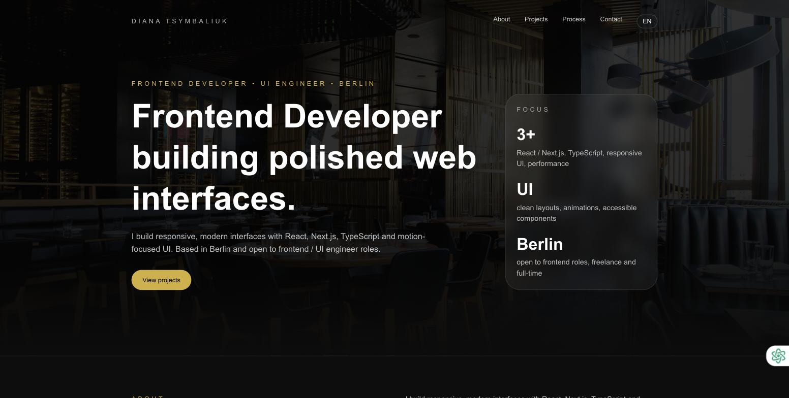

# Diana Tsymbaliuk — Portfolio

**Live: [diana-portfolio-two-roan.vercel.app](https://diana-portfolio-two-roan.vercel.app)**



Personal portfolio site for a Frontend Developer / UI Engineer based in Berlin. Built as a single-page site with sections for About, Projects, Process and Contact, plus a case-study page walking through a featured e-commerce project.

## Features

- Sections: About, Projects, Process, Contact
- Language switcher (EN)
- Case-study subpage for a featured project (product catalog, cart flow, filters)
- Responsive, animated, dark-themed layout

## Tech Stack

- Next.js 16 (App Router)
- React 19
- TypeScript
- Tailwind CSS

## Run locally

```bash
npm install
npm run dev
```

Open [http://localhost:3000](http://localhost:3000).

## Deploy

Deployed on [Vercel](https://vercel.com).
